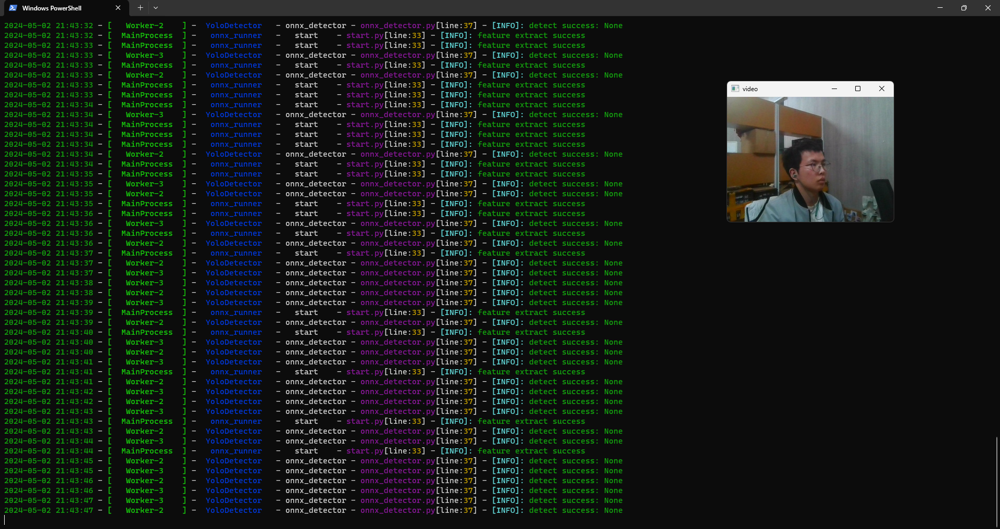

# 迅悟空——电网绝缘子缺陷识别解决方案

## 环境要求

- python3.7+
- [requirements.txt](./requirements.txt)中的第三方依赖

## 环境安装指南

作者为用户提供了两种解决方案：

- **python-pip**
- **python-anaconda**

### Python-pip

使用python3.7+版本，需要使用pip安装[requirements.txt](./requirements.txt)中的第三方依赖。

1. 将pip更新到最新版本

   ```shell
   python -m pip install --upgrade pip
   ```

2. 安装第三方依赖

   ```shell
   pip install -r ./requirements.txt
   ```


<details>
    <summary>下载速度慢？切换国内pip源</summary>
    国内的源有很多，阿里，百度，中科，清华等等，这里我推荐使用清华园的pip，因为这个源和中央源的同步较为频繁，库比较全。
    这里只给出一个简单的教程，具体教程可以参考<a href="https://mirrors.tuna.tsinghua.edu.cn/help/pypi/">清华大学开源软件镜像站</a>
    <pre><code>pip install -r ./requirements.txt -i https://pypi.tuna.tsinghua.edu.cn/simple</code></pre>
</details>    

### 使用AnaConda配置环境

考虑到conda使用者，我们也提供了conda的配置环境的方式。我们将环境打包成了[environment.yml](./environment.yml)文件，用户便可以通过这个加载我们准备好的程序环境。只需要在当前目录下执行以下命令

```shell
conda env create -f environment.yml
```

然后conda就会为我们创建好一个名为predict的虚拟环境，切换到该环境下即可.

```shell
conda activate predict
```

> 如果window环境下已经把conda加入环境列表中，可以尝试使用命令：
> 
> ```shell
> activate predict
> ```

## 运行程序

在环境配置好以后，我们来到deploy目录之下，在终端输入`python ./start.py`就可以了，便可以运行。



这是运行时的截图，其中我们可以在日志文件中看到实时检测结果，同时也可以看到实时拍摄画面。

同时视频拍摄结果也会保存在save_video目录下的video.avi文件中，识别结果会存放在data文件夹下。

运行时按下<kbd>q</kbd>即可终止程序，然后程序会将剩余的识别业务处理完，并且将结果从缓存中刷入磁盘。

日志文件也会保存输出在`logs.log`文件中
